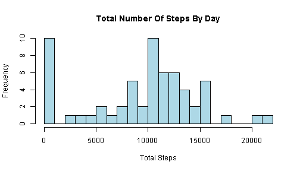
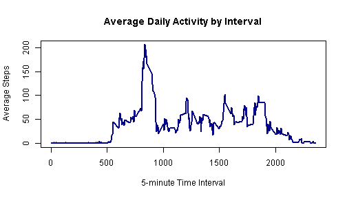
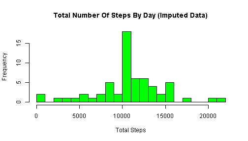
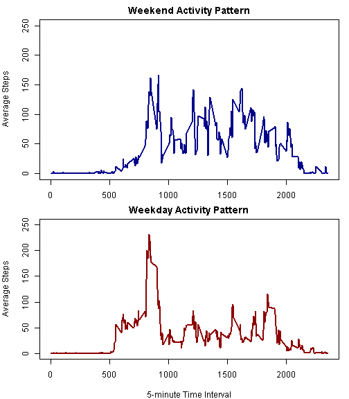

Reproducible Research: Peer Assessment 1
=======================================

## About this project
This work is being done to satisfy Course Project 1 in the Reproducible Research course offered online via Coursera, as part of the Johns Hopkins University Data Science Specialization.

## About the data
The dataset used for this analysis is the Activity Monitoring Dataset. It is included in the repository as **activity.zip**, which contains **activity.csv**. The dataset can be downloaded [here](https://d396qusza40orc.cloudfront.net/repdata%2Fdata%2Factivity.zip).  

The dataset includes three variables:  
- **steps**: Number of steps taking in a 5-minute interval (missing values are coded as NA)  
- **date**: The date on which the measurement was taken in YYYY-MM-DD format  
- **interval**: Identifier for the 5-minute interval in which measurement was taken  

## Loading and preprocessing the data
These are the steps that are taken to load and pre-process the data.  
First, I load required packages and set some options to support the analysis. The dplyr package is used for the majority of the data manipulation. All graphing is done with the base plotting package.   
    

```r
## Introductory code
library(dplyr) ## dplyr is used to process the data for this analysis
options(digits=4) ## format the output to only show 4 digits
options(scipen=999) ## don't print scientific notation
```

Next, I ensure that the required data are available in the current working directory. If not, the file is downloaded and unzipped.

```r
## Look for required data files
setInternet2(use=TRUE)
url <- "https://d396qusza40orc.cloudfront.net/repdata%2Fdata%2Factivity.zip"
filename <- "activity.zip"
if(!file.exists(filename)) {download.file(url, destfile=filename)}
if(!file.exists("activity.csv")) {unzip(filename)}
```

With the CSV data in the working directory, I read in the data.   
The date variable (column 2 of the CSV) is read as a **Date** variable to aid later processing, while steps and interval are of class **integer**.  
To explore the data, we look at the structure of the dataset and an overall summary

```r
## Read in data and display some summary characteristics
acty <- read.csv("activity.csv", header = TRUE, sep = ",", colClasses = c("integer","Date","integer"))
str(acty)
```

```
## 'data.frame':	17568 obs. of  3 variables:
##  $ steps   : int  NA NA NA NA NA NA NA NA NA NA ...
##  $ date    : Date, format: "2012-10-01" "2012-10-01" ...
##  $ interval: int  0 5 10 15 20 25 30 35 40 45 ...
```

```r
summary(acty)
```

```
##      steps            date               interval   
##  Min.   :  0.0   Min.   :2012-10-01   Min.   :   0  
##  1st Qu.:  0.0   1st Qu.:2012-10-16   1st Qu.: 589  
##  Median :  0.0   Median :2012-10-31   Median :1178  
##  Mean   : 37.4   Mean   :2012-10-31   Mean   :1178  
##  3rd Qu.: 12.0   3rd Qu.:2012-11-15   3rd Qu.:1766  
##  Max.   :806.0   Max.   :2012-11-30   Max.   :2355  
##  NA's   :2304
```

As you can see from the structure and summary, the dataset contains 17,568 observations from October 1, 2012 to November 30, 2012. 

## What is mean total number of steps taken per day?
The first question I attempt to answer of the data is the mean total number of steps taken per day. For now, I exclude missing data from the analysis.    
To answer this first question, I present a histogram of total steps each day, and calculate the mean and median.

```r
## Use ddplyr package in chained command to summarise total steps by date
tot_by_day <- acty %>% group_by(date) %>% summarise(tot_steps = sum(steps, na.rm=TRUE))

## plot histogram of data
hist(tot_by_day$tot_steps, breaks=20, 
    main = "Total Number Of Steps By Day",
  	xlab = "Total Steps", col = "light blue"
	)
```

 

```r
## Report the mean and median of the data - used inline
tot_mean <- round(mean(tot_by_day$tot_steps),2)
tot_median <- round(median(tot_by_day$tot_steps),2)
```

The histogram shows a number of zero values, but the distribution is centered around the mean of 9354.23 and the median of 10395

## What is the average daily activity pattern?
The average daily activity pattern can be seen by plotting the average number of steps for each interval throughout the day, as seen in the following figure:

```r
## summarize average steps by interval
avg_by_int <- acty %>% group_by(interval) %>% summarise(mean_steps = mean(steps,na.rm=TRUE))

## plot line graph
plot(avg_by_int$interval, avg_by_int$mean_steps, type="l",
     main = "Average Daily Activity by Interval",
     xlab = "5-minute Time Interval",
     ylab = "Average Steps",
     col = "dark blue", lwd = 2
     )
```

 

```r
## calculate max interval and average steps - used inline
max_row <- subset(avg_by_int, mean_steps==max(mean_steps))
max_steps <- round(max_row$mean_steps,2)
max_int <- max_row$interval
## convert the interval to an expression of time
new_max_int <- paste(round(max_int/100,0),":",max_int %% 100, sep="")
```
The line chart shows a spike in the number of steps in the morning time intervals, before 10 AM. The maximum number of average steps for any time interval is 206.17 which occurs at 8:35. 

## Imputing missing values
The presence of missing days may introduce bias into some calculations or summaries of the data. This next section contains my process for imputing missing values

```r
## Calculate number of missing values - used inline
## I know from summarizing the data earlier that only the steps variable has missing values
nas <- sum(is.na(acty$steps))

## calculate percent of observations that have missing values, display as percentage
pct_nas <- paste(round((nas/length(acty$steps))* 100,2),"%",sep="")
```

The data include **2304 missing values** in the steps variable, representing 13.11% of the observations. To impute these missing values, I use the overall average for the specified time interval. I chose not to use the overall average for the day, as entire days were missing from the data, but no interval had all missing entries.

```r
## create a new data frame that adds two columns:
## first, an average of steps by interval, as in the previous section
## second, an imputed steps column that is initially set equal to the existing steps column
acty_impute <- acty %>% group_by(interval) %>% mutate(mean_steps=mean(steps,na.rm=TRUE),imputed_steps = steps)
## Wherever steps is missing a value, replace imputed steps with the average for that interval, now included in a separate data column.
acty_impute$imputed_steps[is.na(acty_impute$steps)] <- acty_impute$mean_steps[is.na(acty_impute$steps)]

## display new data summary - imputed steps variable should show no missing values
summary(acty_impute)
```

```
##      steps            date               interval      mean_steps    
##  Min.   :  0.0   Min.   :2012-10-01   Min.   :   0   Min.   :  0.00  
##  1st Qu.:  0.0   1st Qu.:2012-10-16   1st Qu.: 589   1st Qu.:  2.49  
##  Median :  0.0   Median :2012-10-31   Median :1178   Median : 34.11  
##  Mean   : 37.4   Mean   :2012-10-31   Mean   :1178   Mean   : 37.38  
##  3rd Qu.: 12.0   3rd Qu.:2012-11-15   3rd Qu.:1766   3rd Qu.: 52.83  
##  Max.   :806.0   Max.   :2012-11-30   Max.   :2355   Max.   :206.17  
##  NA's   :2304                                                        
##  imputed_steps  
##  Min.   :  0.0  
##  1st Qu.:  0.0  
##  Median :  0.0  
##  Mean   : 37.4  
##  3rd Qu.: 27.0  
##  Max.   :806.0  
## 
```

```r
## double-check to ensure no missing values - used inline
new_nas <- sum(is.na(acty_impute$imputed_steps))
```
We can verify that there are 0 missing values in our imputed steps column.  

With the new dataset, we can again look at a histogram of total steps each day, to see how the imputation affected our data.

```r
tot_by_day_imp <- acty_impute %>% group_by(date) %>% summarise(tot_steps = sum(imputed_steps))
hist(tot_by_day_imp$tot_steps, breaks=20,
    main = "Total Number Of Steps By Day (Imputed Data)",
    xlab = "Total Steps", col = "green"
	)
```

 

```r
## calculate new mean and median - used inline
imp_mean <- round(mean(tot_by_day_imp$tot_steps),2)
imp_median <- round(median(tot_by_day_imp$tot_steps),2)

imp_mean_pct <- paste(round((100*(imp_mean-tot_mean)/tot_mean),2),"%",sep="")
imp_median_pct <- paste(round((100*(imp_median-tot_median)/tot_median),2),"%",sep="")
```
As you'll recall from the earlier section, the mean and median when excluding missing values were 9354.23 and 10395, respectively. With the imputation method chosen, the new value for the mean is 10766.19 and median is 10766.19. These values differ from the earlier calculations, with the mean changing by 15.09% and the median changing by 3.57%.

From the histogram we can see that there are far fewer values at the lower end of the distribution. This is because the absence of data for entire days resulted in calculations of zero for the total steps for those days. Perhaps it would be better to exclude those days entirely even in the earlier analysis, rather than counting them as having zero total steps for the day.  

## Are there differences in activity patterns between weekdays and weekends?
For the final portion of the analysis, I compare the activity patterns observed on weekdays and weekends. 

```r
## Add factor variable that equals TRUE for weekends
acty_impute$weekend <- factor(weekdays(acty$date)=="Saturday" | weekdays(acty$date)=="Sunday")

## Calculate average steps by interval and by the new weekend factor variable
new_avg <- acty_impute %>% group_by(interval, weekend) %>% summarise(mean_steps = mean(imputed_steps))
par(mfrow=c(2,1), mar=c(2,4,2,1))
with(subset(new_avg,weekend=="TRUE"),
    plot(interval,mean_steps, type="l",
         main = "Weekend Activity Pattern",
         xlab = "5-minute Time Interval",
         ylab = "Average Steps", ylim = c(0, 250),
         col = "darkblue", lwd=2
         )
    )
par(mar = c(4,4,2,1))
with(subset(new_avg,weekend=="FALSE"),
     plot(interval,mean_steps, type="l",
          main = "Weekday Activity Pattern",
          xlab = "5-minute Time Interval",
          ylab = "Average Steps", ylim = c(0,250),
          col = "darkred", lwd=2
          )
     )
```

 

```r
## Pull out some values from weekend and weekday subsets - used inline
weekday <- subset(new_avg, weekend=="FALSE")
weekend <- subset(new_avg, weekend=="TRUE")

max_row_wknd <- subset(weekend, mean_steps==max(mean_steps))
max_steps_wknd <- round(max_row_wknd$mean_steps,2)
max_int_wknd <- max_row_wknd$interval
## convert the interval to an expression of time
new_max_int_wknd <- paste(round(max_int_wknd/100,0),":",max_int_wknd %% 100, sep="")

max_row_wkdy <- subset(weekday, mean_steps==max(mean_steps))
max_steps_wkdy <- round(max_row_wkdy$mean_steps,2)
max_int_wkdy <- max_row_wkdy$interval
new_max_int_wkdy <- paste(round(max_int_wkdy/100,0),":",max_int_wkdy %% 100, sep="")
```
There do appear to be activity differences between weekdays and weekends, with weekdays showing higher average steps at the peak, but weekends appearing to have higher activity overall throughout the day. Recall that the interval with the maximum number of steps in the entire dataset was 8:35 with 206.17. When separating weekend and weekdays, the new intervals with the most activity are 9:15 with 166.64 steps on the weekends and 8:35 with 230.38 steps on the weekdays.  

## Conclusion
This project involved data processing, exploratory data analysis, and missing value imputation to give an example of reproducible research fundamentals. This file should include all of the necessary information for another researcher to reproduce exactly the analysis I completed as part of this project.
